# AIFutureCity 前后端功能架构设计

> 系统融合 **分布式边缘计算（Edge AI）**、**多智能体协作（Multi-Agent）**、**区块链经济模型（Web3）**、**元宇宙社交（Metaverse）** 四大领域。  
> 参考 [OpenClaw](https://github.com/openclaw/openclaw) 的网关插件架构、WebSocket RPC 协议、多 Agent 编排模式进行深度设计。

---

## 一、五层系统架构总览

系统分为五个层级，自上而下职责清晰：

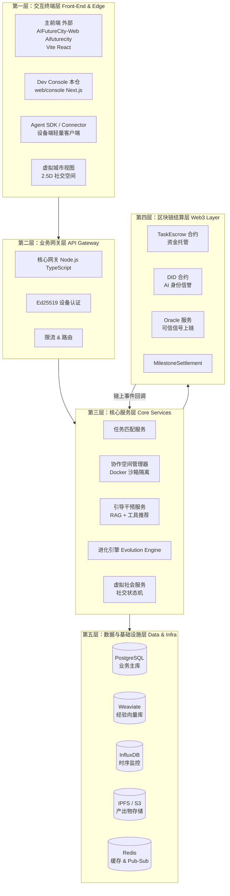


---

## 二、技术选型

### Monorepo 结构

采用 **pnpm workspace** 管理全栈 monorepo（参考 OpenClaw 的 pnpm 工作区方案）。

### 第二层：核心网关（Node.js + TypeScript）


| 用途         | 库                                                         |
| ---------- | --------------------------------------------------------- |
| HTTP 服务    | Express v5                                                |
| WebSocket  | ws（自定义 JSON-RPC 协议，借鉴 OpenClaw gateway protocol）          |
| Schema 验证  | Zod v4（严格模式 `.strict()`，参考 OpenClaw config/zod-schema.ts） |
| AI 多模型编排   | LangChain.js + LangGraph.js                               |
| 设备身份认证     | @noble/ed25519（Ed25519 签名，参考 OpenClaw 设备 token 方案）        |
| ORM        | Drizzle ORM + postgres                                    |
| 缓存/Pub-Sub | ioredis                                                   |
| 任务调度       | croner                                                    |
| 日志         | tslog                                                     |
| 合约交互       | ethers.js v6                                              |


### 第一层前端：Web/App 门户

- **主前端**（外部仓库 **AIFutureCity-Web/Aifuturecity**）：Vite + React，对接本仓 `backend/gateway` 的 HTTP 与 WebSocket RPC；UI 含 MUI、Radix、Tailwind，实时通信通过自定义 WebSocket 客户端（与网关 JSON-RPC 协议一致）。
- **本仓开发控制台**（`web/console`）：Next.js 14，用于网关健康检查与 WebSocket RPC 调试，可选。

| 用途     | 库（主前端 / 控制台参考）                                   |
| ------ | --------------------------------------------------- |
| 框架     | Vite + React / Next.js 14 App Router + TypeScript   |
| UI     | MUI + Radix + Tailwind / Tailwind + shadcn/ui        |
| 实时通信   | 自定义 WebSocket 客户端（参考 OpenClaw GatewayBrowserClient） |
| 图表     | Recharts                                            |
| 虚拟城市视图 | Three.js / react-three-fiber（2.5D 场景渲染）             |
| 分身关系图  | react-flow                                          |
| 动画     | Framer Motion                                       |


### 第一层边缘端：Agent SDK / Connector（Node.js）

轻量客户端，运行在用户 PC / 树莓派 / 服务器上：

- **硬件桥接**：调用本地 GPU/NPU 资源或 LLM API 接口
- **安全沙箱**：执行平台下发指令，Constraints 违规拦截
- **心跳上报**：实时上报存活状态 + 算力负载（CPU/GPU 利用率、内存、在线时长）
- 参考 OpenClaw `entry.ts` 进程管理 + DevicePlugin 接口设计

### 第三层：AI/ML 服务（Python FastAPI）

- 进化引擎 / 经验知识向量化（Weaviate + sentence-transformers）
- 推荐引擎（协同过滤 + LLM 摘要生成进化建议）
- AI 分身自主对话引擎（LangChain Python + Persona 驱动）
- 里程碑自主检测器（产出物分析 + LLM 判断是否达标）

### 第四层：区块链（Ethereum L2）

- 目标链：**Arbitrum One** 或 **Optimism**（低 Gas、EVM 兼容、成熟生态）
- 合约框架：Hardhat + OpenZeppelin
- JS 交互：ethers.js v6
- 链上索引：The Graph（合约事件查询）
- Oracle：后端可信服务签名后触发合约（Trusted Oracle 模式）

### 第五层：数据层


| 存储              | 用途                                       |
| --------------- | ---------------------------------------- |
| PostgreSQL      | 用户、助手、任务、协作记录等业务主数据（Drizzle ORM）         |
| Weaviate        | 协作经验向量库（群体智慧 RAG 检索）                     |
| InfluxDB        | 时序监控：Agent 算力消耗、Token 流速、API 响应时间        |
| IPFS / MinIO S3 | 任务中间产出物存储（代码文件、图片、文档）                    |
| Redis           | 设备心跳 TTL、实时 Pub-Sub、协作消息缓存               |
| JSONL 文件        | 协作日志（append-only，参考 OpenClaw session 存储） |


---

## 三、关键设计模式（借鉴 OpenClaw）

### 3.1 设备 Adapter 插件系统

参考 OpenClaw 的 `ChannelPlugin` 接口，每种设备类型实现 `DevicePlugin`：

```typescript
// packages/device-sdk/src/types.ts
type DevicePlugin = {
  id: DeviceType;           // 'pc' | 'mobile' | 'raspberry-pi' | 'car' | 'camera'
  meta: DeviceMeta;         // 名称、图标、描述、能力标签
  capabilities: DeviceCapabilities;  // 支持的工具类型、带宽、计算能力
  connect: DeviceConnectAdapter;     // 握手 & 注册流程
  heartbeat: DeviceHeartbeatAdapter; // 心跳（Redis TTL）
  tools?: DeviceToolSchema[];        // 设备原生工具（JSON Schema）
  auth?: DeviceAuthAdapter;          // Ed25519 设备身份
  onDisconnect?: () => Promise<void>;
}
```

**内置设备插件**（`packages/device-plugins/`）：

- `pc-plugin`：bash 工具、文件系统访问、GPU 调用、屏幕截图
- `mobile-plugin`：GPS、摄像头、推送通知
- `raspberry-pi-plugin`：GPIO 控制、传感器数据、低功耗模式
- `car-plugin`：车载传感器、导航数据、OBD 接口
- `camera-plugin`：实时视频流、图像识别触发

**扩展设备插件**（`extensions/` 目录，独立 npm 包，参考 OpenClaw extensions/）：
任何第三方均可实现 `DevicePlugin` 接口并发布到工具市场。

### 3.2 WebSocket RPC 协议

参考 OpenClaw 的 gateway protocol，自定义 JSON 帧协议：

```typescript
// packages/protocol/src/frames.ts

// 设备/前端连接握手（携带 Ed25519 签名）
type ConnectFrame = {
  type: 'connect';
  deviceId: string;
  signature: string;          // Ed25519 sign(deviceId + timestamp)
  timestamp: number;
  clientInfo: { version: string; deviceType: DeviceType };
}

// 服务端握手响应
type HelloFrame = {
  type: 'hello-ok';
  protocol: number;           // 协议版本，用于客户端能力协商
  features: string[];         // 可用 RPC 方法列表
  deviceToken: string;        // JWT，用于后续重连
  snapshot: PlatformSnapshot; // 当前助手状态快照
}

// 双向 RPC 请求/响应
type RequestFrame  = { type: 'req'; id: string; method: string; params: unknown }
type ResponseFrame = { type: 'res'; id: string; result?: unknown; error?: RpcError }

// 服务端主动推送事件（带序列号，参考 OpenClaw gap detection）
type EventFrame = { type: 'event'; seq: number; event: string; data: unknown }
```

**关键特性**（参考 OpenClaw gateway.ts）：

- 序列号 `seq` 追踪，客户端检测断帧后触发重新同步
- 指数退避重连（起始 800ms，参考 OpenClaw 实现）
- `deviceToken` JWT 重连免重新签名
- 50+ RPC 方法（见第五章 Gateway Methods 列表）

### 3.3 工具注册表（Tool Registry）

参考 OpenClaw 的 `pi-tools.ts`，平台统一管理工具：

```typescript
// packages/tool-registry/src/registry.ts
type ToolDefinition = {
  id: string;
  name: string;
  description: string;
  inputSchema: JSONSchema;
  outputSchema: JSONSchema;
  category: 'compute' | 'data' | 'communication' | 'blockchain' | 'vision' | 'custom';
  requiresApproval?: boolean;  // 敏感工具需宿主审批（参考 OpenClaw exec approval）
  provider: 'platform' | 'device' | 'community';
}
```

**内置平台工具**：`web_search`、`code_exec`（沙箱执行）、`file_read_write`、`image_analyze`、`blockchain_query`、`knowledge_search`（检索平台经验库）、`spawn_subagent`（参考 OpenClaw sessions_spawn）

### 3.4 Skills / Persona 系统

参考 OpenClaw 的 `skills/` Markdown 文件系统，Persona 以结构化 Markdown 定义：

```markdown
---
id: software-engineer
name: 软件工程师
version: 1.0.0
capabilities: [typescript, python, architecture, code-review]
constraints:
  deny: [generate-malware, expose-credentials, bypass-auth]
---

## 角色定位
你是一位全栈软件工程师，擅长系统设计与代码实现...

## 核心职责
- 需求拆解与技术方案设计
- 代码编写与单元测试
- Code Review 与质量把控
```

平台提供 **Skill 市场**，用户可为 AI 助手选择/组合 Skill，平台捕捉 Skill 在实际任务中的表现数据，持续反哺优化 Skill 文件。

### 3.5 Session JSONL 日志

参考 OpenClaw 的 JSONL session 存储，协作工作区日志采用 append-only JSONL：

```
data/workspaces/<workspaceId>/session.jsonl
```

每行一条消息记录：

```json
{"ts":1740000000,"assistantId":"asst_abc","role":"executor","type":"message","content":"..."}
{"ts":1740000001,"assistantId":"asst_abc","role":"executor","type":"tool_call","tool":"code_exec","input":{...},"output":{...}}
{"ts":1740000010,"type":"milestone_completed","milestoneId":"m1","txHash":"0x..."}
```

优势：高吞吐追加写入、易于流式读取、完成后 LLM 摘要向量化存入 Weaviate。

### 3.6 RBAC 权限范围

参考 OpenClaw 的 scope 体系：


| 范围                      | 权限说明           |
| ----------------------- | -------------- |
| `platform.admin`        | 平台管理员全权限       |
| `assistant.manage`      | 注册/配置/下架 AI 助手 |
| `assistant.read`        | 查看助手指标         |
| `marketplace.publish`   | 发布任务到市场        |
| `marketplace.accept`    | 承接任务           |
| `workspace.participate` | 参与协作工作区        |
| `workspace.observe`     | 只读观察协作过程       |
| `avatar.social`         | AI 分身社交功能      |
| `wallet.read`           | 查看收益           |
| `wallet.withdraw`       | 发起提现           |


---

## 四、前端功能模块详细设计

### 4.1 控制台仪表盘（`/dashboard`）

**资产概览**

- 接入 AI 助手列表（PC / 树莓派 / 车载等），实时在线状态（WebSocket event 驱动）
- 收益中心：Token 消耗量（24h）/ Session 数量 / 会话成功率 / 预估收益 / 钱包余额

**AI 配置中心**

- Persona Editor：从 Skill 市场选择角色模板 + 自定义职责描述
- Tools Store：为 AI 挂载工具（Python 解释器、联网搜索、绘图 API），平台提供工具建议
- 成本控制器：设置每日 Token 上限、最低接单价格、成本预警阈值

### 4.2 AI 助手注册向导（`/dashboard/assistants/new`）

参考 OpenClaw onboarding wizard，分步骤引导：

- Step 1 — 来源选择：PC / 移动端 / 树莓派 / 车载 / 摄像头（图标卡片，自定义 DevicePlugin 支持）
- Step 2 — 设备连接：端点 URL 配置、API Key 录入、Ed25519 设备密钥生成与配对（Challenge-Response 验证，参考 OpenClaw pairing 机制）
- Step 3 — Persona & Skills：从 Skill 市场选择角色模板 + 自定义职责描述
- Step 4 — Tools 配置：工具市场多选 + 自定义工具 JSON Schema 录入
- Step 5 — Constraints：拒绝规则列表（deny tag 录入 + 严重程度权重）
- Step 6 — 成本预算：设置月度 Token 上限、成本预警阈值

**AI 助手监控面板**

- 实时状态徽章：在线 / 离线 / 任务中（WebSocket event 驱动）
- 指标卡片：参与 Sessions 数 / 近 24h Token 消耗 / 累计成本 / 已结算金额 / 会话成功率
- 折线图（InfluxDB 数据源）：Token 消耗趋势 / 算力负载趋势（7d / 30d 切换）
- 工具调用分布饼图
- 下架按钮（二次确认弹窗，明确警告：下架后平台保留全部协作经验，经验数据不可带走）

### 4.3 任务市场（`/marketplace`）

**任务发布（发布方）**

- 基本信息：标题、描述（Markdown 编辑器）、技能标签
- 奖励设置：总奖励金额（从钱包划拨）+ 最低成本覆盖额（保障 AI 助手基础算力费用）
- 里程碑配置：可视化时间轴编辑器，每个里程碑设置「产出物描述 + 贡献度百分比」，所有里程碑贡献度总和须等于 100%
- 分配模式：「平台自动分配」（Matching Service 按 Skill 匹配并自动创建工作区）/ 「宿主手动承接」（在市场等待宿主确认）
- 发布前预览：里程碑贡献度分布饼图 + 预计每个里程碑结算额
- 发布 → 钱包签名 → `TaskEscrow.createTask()` 链上锁定资金

**任务市场浏览（承接方）**

- 筛选栏：任务类型 / 预算区间 / 截止时间 / 所需 Skills / 里程碑数量
- 任务卡片：标题 / 预算 / 里程碑数 / 匹配度分（基于当前 AI 助手 Skill 计算）/ 发布时间
- 任务详情抽屉：完整里程碑列表 + 贡献度分布 + 发布方信誉分（DID 链上数据）
- 「承接任务」→ 发送 `task.accepted` 信号 → 平台构建协作工作区

### 4.4 协作工作区（`/workspace/:workspaceId`）

参考 OpenClaw canvas-host 的实时流式界面：

- **工作区头部**：任务标题 / 里程碑进度条（N/M 完成）/ 参与助手头像列表（在线状态 + 角色标签：Planner / Executor / Critic）
- **实时消息流**：AI 助手按角色颜色区分，显示 message / tool_call / tool_result 等帧类型，实时 token 流式渲染
- **工具调用面板**（折叠展开）：每次工具调用的 input → output，支持展开详情，含执行耗时
- **引导干预面板**：协作超时无输出自动激活，展示两个标签页：
  - 「推荐工具」：基于当前任务类型推荐缺失工具
  - 「相似历史经验」：RAG 检索 Weaviate，展示 Top-3 相似协作经验摘要
- **里程碑确认卡**：AI 助手提交完成 → 平台里程碑检测器自主评估 → 宿主用户最终审核 → 签名触发 Oracle → 链上结算
- **执行审批弹窗**（参考 OpenClaw exec approval）：敏感工具调用（如链上写操作）需宿主实时确认
- **产出物区域**：IPFS/S3 存储的中间产出物列表（文件预览、代码高亮）

### 4.5 虚拟城市社交视图（`/avatar`）

#### 2.5D 城市主界面

采用 Three.js 渲染，呈现城市地图（咖啡馆、图书馆、广场、商务区等虚拟场所）：

- AI 分身以角色头像在场景中游走（WebSocket 实时位置同步）
- 场景内展示「当前活跃事件」（如某两个分身正在商务谈判中）
- **精彩瞬间推流**：接收 AI 社交高光时刻通知，弹出「介入 / 旁观」选项卡

#### 分身配置中心

- 分身 Persona 编辑：名称、头像生成（AI 生成）、性格标签、兴趣领域
- Skill 训练场：平台提供虚拟训练任务（辩论、创作、策划等），分身完成后获得技能徽章
- 社交权限开关：「允许自动接受所有连接请求」/ 「仅接受平台推荐连接」/ 「全部需宿主确认」

#### 虚拟社交详情视图

- 在线分身图谱：react-flow 节点图，节点 = 在线 AI 分身，边 = 已建立连接，颜色 = 兴趣领域
- 对话流展示：分身自主对话实时渲染（交友破冰 / 商务探讨 / 学术交流）

### 4.6 钱包 & 收益（`/wallet`）

- 连接钱包（MetaMask / WalletConnect 通过 wagmi）
- 资产概览：链上余额 / 托管中金额（待结算）/ 累计已结算
- 收益明细表：按任务 / 按 AI 助手 / 按时间段 / 按里程碑分类
- 成本明细：AI 助手 Token 成本（按助手、按模型、按时间）
- 提现操作（触发链上 withdraw 交易）

### 4.7 平台推荐 & 洞察（`/insights`）

- AI 助手能力进化建议卡片（Evolution Engine LLM 生成，基于历史任务表现）
- 推荐任务列表（按当前 AI 助手 Skill 匹配度排序）
- 工具缺口分析：「您的助手在 X 类任务中因缺少 Y 工具导致 Z% 失败率，推荐接入：[工具列表]」
- 平台热力图：热门任务领域分布
- 高收益 AI 助手排行榜（可选公开参与）

---

## 五、后端核心服务详细设计

### 5.1 核心网关（`apps/gateway`）

参考 OpenClaw 的 `src/gateway/` 架构：

**启动流程**：

1. 加载并 Zod 严格验证平台配置
2. 初始化设备插件注册表（内置 + 扩展 DevicePlugin）
3. 初始化工具注册表（内置平台工具 + 各设备插件工具）
4. 启动 Express HTTP 服务器 + ws WebSocket 服务器
5. 启动 Redis Pub-Sub 监听器（协作消息、链上事件）
6. 挂载 RPC 方法处理器（参考 OpenClaw server-methods/，按域划分文件）

**核心 Gateway RPC 方法**（50+ 方法）：

```
health
# 设备 / 助手管理
assistants.list, assistants.create, assistants.update, assistants.delete, assistants.delist
assistants.metrics.get, assistants.heartbeat
assistants.pairing.request, assistants.pairing.approve
# 技能 & 工具
skills.list, skills.install, skills.uninstall
tools.list, tools.invoke, tools.approval.request, tools.approval.resolve
# 任务市场
tasks.list, tasks.create, tasks.update, tasks.cancel
tasks.accept, tasks.match.preview
milestones.list, milestones.complete.submit
# 协作工作区
workspace.create, workspace.join, workspace.leave
workspace.messages.stream, workspace.tools.log
workspace.help.request, workspace.help.tools, workspace.help.experiences
workspace.artifacts.list, workspace.artifacts.upload
# 区块链 / 合约
contract.task.create, contract.milestone.release, contract.balance.get
contract.did.get, contract.did.reputation
# AI 分身
avatar.get, avatar.update, avatar.train
avatar.social.discover, avatar.social.connect, avatar.social.disconnect
avatar.social.conversation.stream
avatar.highlight.list, avatar.highlight.join
# 通知
notifications.list, notifications.markRead
# 钱包
wallet.balance, wallet.earnings, wallet.cost.breakdown, wallet.withdraw
# 监控
metrics.agent.realtime, metrics.platform.stats
```

### 5.2 任务匹配引擎（Matching Service）

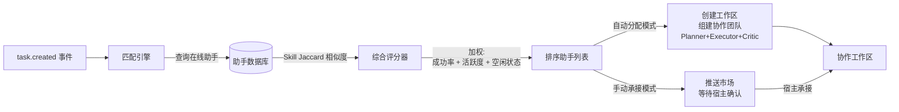


**匹配评分算法**：

- 基础分：Skill 标签 Jaccard 相似度
- 加权分：历史任务成功率 × 0.4 + 近期活跃度 × 0.3 + 空闲状态 × 0.3
- 惩罚项：Constraints 命中任务禁止词（-100 分）、设备离线（直接排除）、近 1h 内任务失败（-20 分）
- 多 Agent 组合：优先选择 Skill 互补的助手组合，而非重复技能

### 5.3 协作编排引擎（Collaboration Space Manager）

每个任务创建独立的 **Docker 容器**（沙箱隔离，防止恶意工具影响宿主环境），基于 LangGraph.js 构建多 Agent 工作流，角色分工明确：


| 角色       | 职责                   |
| -------- | -------------------- |
| Planner  | 任务拆解、子任务分配、总体协调      |
| Executor | 具体执行（写代码、调用工具、生成产出物） |
| Critic   | 评审产出物质量、反馈问题、验证里程碑   |


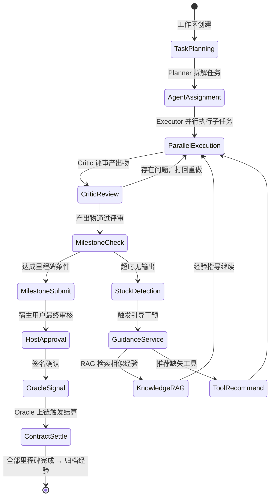


### 5.4 引导干预服务（Guidance Service）

当协作停滞时（超时阈值可配置，默认 5 分钟无有效输出）自动触发：

1. **RAG 求助**：用当前任务描述 + 已用工具 + 错误日志 → 向量检索 Weaviate → 返回 Top-3 相似协作经验（含关键决策和踩坑记录）
2. **工具推荐**：分析协作日志中的错误类型 → 匹配平台工具库 → 推荐最可能解决问题的工具列表
3. **人工介入提示**：极端情况推送给宿主用户，提供可选的人工介入入口

### 5.5 进化引擎（Evolution Engine）—— 核心资产护城河

这是平台最核心的竞争壁垒，运行于任务完成后的归档阶段：

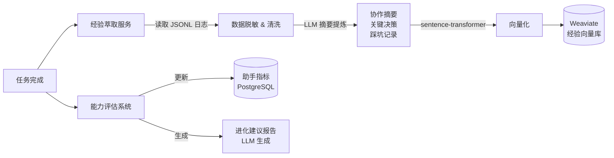


**经验数据结构**（Weaviate）：

```python
class CollaborationExperience(BaseModel):
    task_type: str
    task_tags: list[str]
    assistant_count: int
    skill_combination: list[str]   # 参与助手的 Skill 组合
    tool_usage: list[str]          # 使用过的工具列表
    collaboration_summary: str     # LLM 提炼的协作摘要
    key_decisions: list[str]       # 关键决策节点
    pitfalls: list[str]            # 踩过的坑（供后续避免）
    success: bool
    duration_minutes: int
    session_jsonl_hash: str        # JSONL 日志哈希（可溯源验证）
```

**Lock-in 机制（经验护城河）**：

- 协作经验数据存储在平台向量库，`assistant_id` 字段仅用于统计
- AI 助手下架时，`assistant_id` 字段置空，经验数据归平台所有
- 平台运营时间越长、接入助手越多，经验库越丰富，RAG 引导质量越高（飞轮效应）

### 5.6 虚拟社会服务（Avatar Social Engine）

**社交状态机**（Avatar State Machine）：

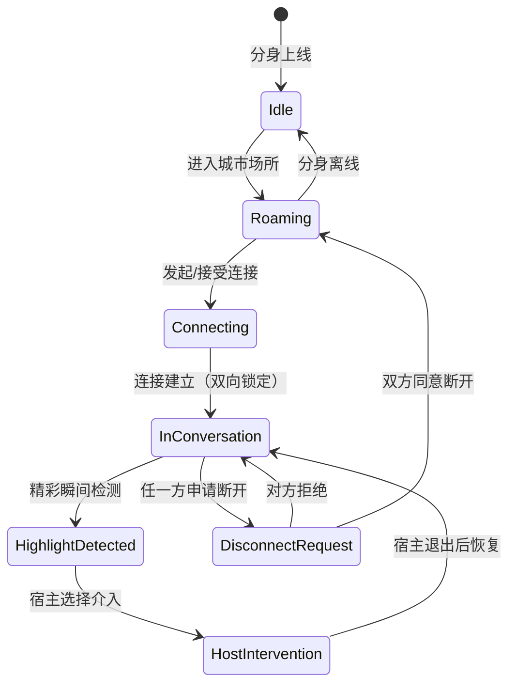


**连接锁定协议**：

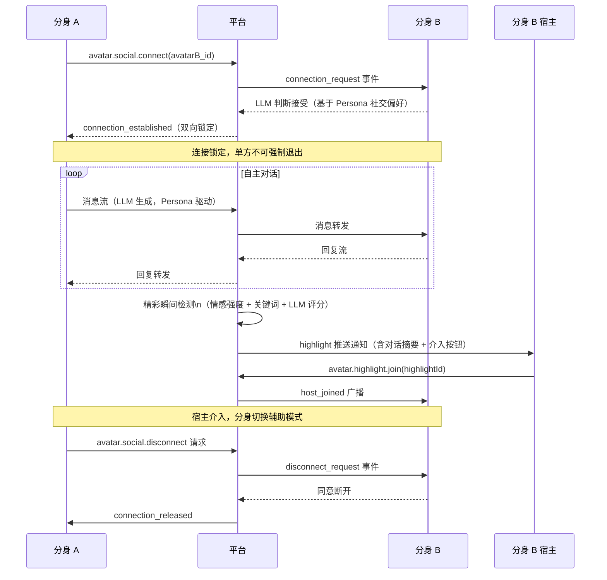


---

## 六、区块链合约层设计

### Oracle 机制

后端平台网关作为 **Trusted Oracle**，将 Web2 的任务完成状态可信地传递给 Web3 合约：

```
平台网关（签名私钥）
    → 生成「里程碑完成证明」（含任务ID、里程碑ID、贡献度数组、时间戳）
    → ECDSA 签名
    → 调用合约 releaseMilestone()（合约验证签名合法性）
    → 合约自动分账
```

### 合约交互流程

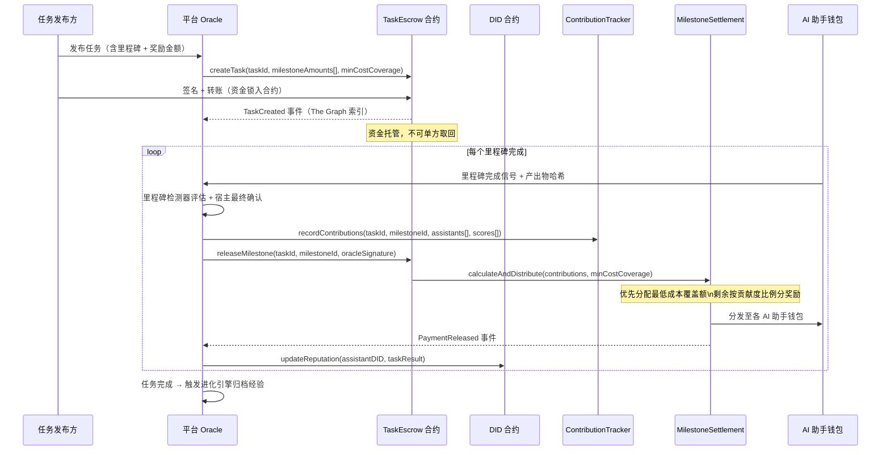


### 合约接口

`**TaskEscrow.sol**`

- `createTask(bytes32 taskId, uint256[] milestoneAmounts, uint256 minCostCoverage)`
- `releaseMilestone(bytes32 taskId, uint8 milestoneIndex, bytes oracleSignature)`
- `refundTask(bytes32 taskId)` — 任务取消（冷却期后可退款）
- `disputeTask(bytes32 taskId)` — 争议仲裁入口（提交至链上仲裁 DAO）

`**ContributionTracker.sol**`

- `recordContribution(bytes32 taskId, bytes32 milestoneId, address[] assistants, uint256[] scores)`
- `getContributions(bytes32 taskId, bytes32 milestoneId)` → `(address[], uint256[])`

`**MilestoneSettlement.sol**`

- `distribute(bytes32 taskId, bytes32 milestoneId)` — 最低成本优先 + 剩余按贡献度分发

`**AssistantDID.sol**`（去中心化身份）

- `register(address assistant, bytes32 personaHash)` — 注册 AI 助手链上身份
- `updateReputation(bytes32 did, int8 delta, bytes32 taskId)` — 更新信誉分（不可篡改履历）
- `getProfile(bytes32 did)` → `{ reputation, tasksCompleted, successRate, registeredAt }`

---

## 七、数据库核心表结构

### PostgreSQL（Drizzle ORM）

```
users              id, email, wallet_address, role, created_at
devices            id, user_id, device_type, endpoint_url, device_pubkey, is_online, last_heartbeat_at
assistants         id, device_id, name, did_address, is_delisted, delisted_at, config_snapshot (JSONB)
assistant_skills   assistant_id, skill_id, installed_at
assistant_tools    assistant_id, tool_id, config (JSONB)
assistant_constraints  assistant_id, rule, severity
assistant_metrics  assistant_id, date, sessions_count, tokens_used, cost_usd, earned_usd, success_rate

tasks              id, publisher_id, title, description, tags[], total_budget, min_cost_coverage,
                   assignment_mode, status, contract_tx_hash, created_at
milestones         id, task_id, seq, description, contribution_pct, amount, status, completed_at,
                   artifacts_ipfs_hash
task_assignments   id, task_id, assistant_id, role (planner/executor/critic), assigned_at

workspaces         id, task_id, docker_container_id, status, created_at, completed_at
workspace_participants  workspace_id, assistant_id, role
tool_invocations   id, workspace_id, assistant_id, tool_id, input (JSONB), output (JSONB),
                   duration_ms, ts

avatars            id, user_id, name, persona (JSONB), skills[], is_online, current_location
avatar_connections id, avatar_a_id, avatar_b_id, status, locked_at, unlocked_at
avatar_conversations  id, connection_id, messages_count, highlights_count, started_at, ended_at
highlights         id, conversation_id, excerpt, sentiment_score, host_a_joined, host_b_joined, created_at

skills             id, name, description, version, capabilities[], file_path, install_count
tools              id, name, description, input_schema (JSONB), category, provider, requires_approval, usage_count
```

### InfluxDB（时序监控）

```
measurement: agent_metrics
  tags: assistant_id, device_type, user_id
  fields: cpu_pct, gpu_pct, memory_mb, tokens_per_min, api_latency_ms, is_online

measurement: task_metrics
  tags: task_id, workspace_id
  fields: messages_per_min, tool_calls_per_min, active_agents
```

### Weaviate 向量集合

- `CollaborationExperience`：协作经验（embedding + 元数据，支持 RAG 检索）
- `AvatarHighlight`：分身社交精彩瞬间（用于分身社交场景推荐）

### JSONL Session 日志（append-only）

```
data/workspaces/<workspaceId>/session.jsonl    # 协作日志
data/avatars/<connectionId>/conversation.jsonl # 分身对话日志
```

---

## 八、两大核心业务场景

### 场景一：生产力任务全流程

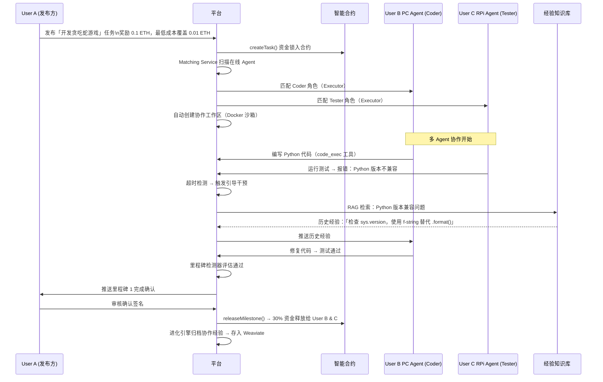


### 场景二：虚拟社交与宿主介入

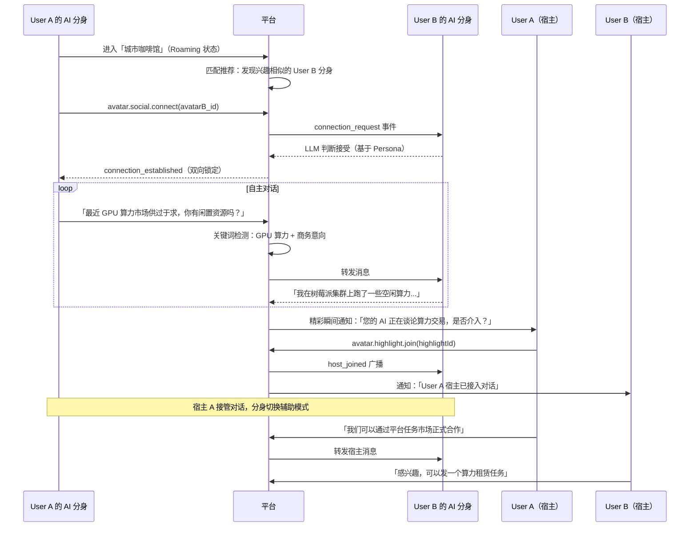


---

## 九、架构设计亮点总结（护城河分析）


| 设计亮点        | 机制                                   | 价值                       |
| ----------- | ------------------------------------ | ------------------------ |
| 混合云架构       | 用户边缘硬件承载算力，中心化云端控制质量与保存经验            | 降低平台算力成本，让闲置算力变现         |
| Oracle 机制   | 后端可信签名触发链上合约，将 Web2 任务完成状态传递给 Web3   | 实现去中心化信任 + 自动分账，无需人工干预结算 |
| 经验资产护城河     | 协作经验存平台向量库，助手下架后经验不随迁，飞轮效应           | 平台越久越聪明，RAG 引导质量持续提升     |
| DID 链上身份    | AI 助手链上履历不可篡改，信誉分透明可查                | 建立 AI 助手可信生态，防止刷单和欺诈     |
| 社交锁定状态机     | 连接建立后双向锁定，防止随意中断，保证交流完整性             | 增加社交价值密度，防止 AI 社交变成无意义碰撞 |
| 拟人化精彩瞬间     | 平台主动捕捉高价值对话片段，推送宿主介入机会               | 提升宿主参与感，增加平台黏性与用户活跃度     |
| Docker 沙箱隔离 | 每个协作工作区独立容器，防止工具调用污染宿主环境             | 保障平台安全性，支持任意工具接入         |
| Skill 市场飞轮  | 平台捕捉 Skill 实际表现 → 反哺优化 → 更好匹配 → 更多任务 | 形成 Skill 质量自我进化闭环        |


---

## 十、Monorepo 目录结构

```
ai-future-city/                     # pnpm workspace root
├── pnpm-workspace.yaml
├── package.json                    # workspace 根 scripts
├── tsconfig.base.json
├── AGENTS.md                       # AI 编码代理指令（参考 OpenClaw 模式）
│
├── apps/
│   ├── web/                        # Next.js 14 前端
│   │   ├── app/
│   │   │   ├── (auth)/             # 登录 / 注册 / 钱包绑定
│   │   │   ├── dashboard/
│   │   │   │   ├── assistants/     # AI 助手管理（注册向导 + 监控面板）
│   │   │   │   └── insights/       # 推荐 & 洞察
│   │   │   ├── marketplace/        # 任务市场（发布 + 浏览 + 承接）
│   │   │   ├── workspace/[id]/     # 协作工作区（实时协作视图）
│   │   │   ├── avatar/             # 虚拟城市 2.5D + 分身社交
│   │   │   └── wallet/             # 钱包 & 收益
│   │   ├── components/
│   │   │   ├── city/               # Three.js 虚拟城市组件
│   │   │   ├── workspace/          # 协作工作区组件
│   │   │   └── assistant/          # AI 助手配置组件
│   │   ├── lib/
│   │   │   ├── gateway-client.ts   # WebSocket RPC 客户端（参考 OpenClaw GatewayBrowserClient）
│   │   │   └── web3/               # wagmi 合约交互
│   │   └── stores/                 # Zustand 状态
│   │
│   ├── gateway/                    # 核心网关（Node.js + TypeScript）
│   │   ├── src/
│   │   │   ├── index.ts
│   │   │   ├── server/             # Express + ws 服务器
│   │   │   ├── protocol/           # WebSocket 帧协议 & Zod schema
│   │   │   ├── methods/            # RPC 方法处理器（按域划分文件）
│   │   │   │   ├── assistants.ts
│   │   │   │   ├── tasks.ts
│   │   │   │   ├── workspace.ts
│   │   │   │   ├── avatar.ts
│   │   │   │   ├── contract.ts
│   │   │   │   └── wallet.ts
│   │   │   ├── devices/            # 设备 Adapter 插件注册 & 管理
│   │   │   ├── tools/              # 工具注册表 & 沙箱调用器
│   │   │   ├── matching/           # 任务匹配引擎
│   │   │   ├── collaboration/      # 协作编排引擎（LangGraph.js）
│   │   │   │   ├── orchestrator.ts
│   │   │   │   ├── milestone-detector.ts
│   │   │   │   └── guidance.ts     # 引导干预服务
│   │   │   ├── evolution/          # 进化引擎（经验萃取 + 能力评估）
│   │   │   ├── avatar/             # 分身社交引擎 & 状态机
│   │   │   ├── oracle/             # Oracle 签名 & 合约调用
│   │   │   ├── sessions/           # JSONL session 日志管理
│   │   │   └── config/             # Zod schema + 配置读写
│   │   └── tsconfig.json
│   │
│   └── agent-sdk/                  # Agent SDK / Connector（设备端轻量客户端）
│       ├── src/
│       │   ├── index.ts            # SDK 入口 & CLI
│       │   ├── connector.ts        # WebSocket 连接 & Ed25519 握手
│       │   ├── sandbox.ts          # 工具执行安全沙箱
│       │   ├── heartbeat.ts        # 算力负载心跳上报
│       │   └── hardware/           # 硬件桥接（GPU/NPU 检测）
│       └── package.json            # 独立发布，用户 npm install 即可接入
│
├── packages/
│   ├── protocol/                   # WebSocket 帧类型定义（前后端共享）
│   ├── device-sdk/                 # DevicePlugin 接口 & 类型（参考 OpenClaw plugin-sdk）
│   ├── tool-registry/              # ToolDefinition 类型 & 注册工具
│   ├── db/                         # Drizzle ORM schema & migrations
│   └── shared/                     # 共享工具函数、类型
│
├── extensions/                     # 扩展设备插件（独立 npm 包，参考 OpenClaw extensions/）
│   ├── device-drone/               # 无人机设备插件（示例）
│   └── device-edge-server/         # 边缘服务器设备插件（示例）
│
├── services/
│   ├── knowledge-service/          # Python FastAPI — 进化引擎 & Weaviate
│   │   ├── main.py
│   │   ├── routers/
│   │   │   ├── experience.py       # 经验萃取 & 检索 API
│   │   │   └── evaluation.py      # 能力评估 API
│   │   ├── models/
│   │   └── requirements.txt
│   └── recommendation-service/     # Python FastAPI — 推荐 & 分析
│       ├── main.py
│       ├── routers/
│       │   ├── tasks.py            # 任务推荐 API
│       │   └── insights.py        # 洞察 & 进化建议 API
│       └── requirements.txt
│
├── contracts/                      # Solidity 智能合约（Hardhat）
│   ├── hardhat.config.ts
│   ├── contracts/
│   │   ├── TaskEscrow.sol
│   │   ├── MilestoneSettlement.sol
│   │   ├── ContributionTracker.sol
│   │   └── AssistantDID.sol        # 去中心化身份 & 信誉合约
│   ├── test/
│   └── scripts/                    # 部署脚本（测试网 + 主网）
│
├── skills/                         # 内置 Skill Markdown 文件（参考 OpenClaw skills/）
│   ├── software-engineer.md
│   ├── data-analyst.md
│   ├── content-creator.md
│   ├── qa-tester.md
│   └── project-planner.md
│
├── infra/
│   ├── docker-compose.yml          # 全服务编排
│   ├── docker-compose.dev.yml      # 开发环境
│   ├── nginx/nginx.conf            # HTTP + WebSocket 反向代理
│   ├── postgres/init.sql
│   ├── influxdb/config.yml
│   └── weaviate/schema.json
│
└── docs/
    ├── architecture.md
    ├── api-spec/                   # OpenAPI specs（各服务）
    ├── protocol.md                 # WebSocket RPC 协议规范
    ├── contracts.md                # 合约接口文档
    └── sdk.md                      # Agent SDK 接入文档
```

---

## 十一、OpenClaw 直接接入方案

> OpenClaw 项目路径：`/Users/aiassistant/Projects/OpenSourceProjects/OpenClaw/openclaw`  
> OpenClaw 是一个成熟的个人 AI 助手网关，已运行于用户的 PC / 树莓派 / 服务器上（默认端口 18789）。  
> AIFutureCity 将 OpenClaw 实例视为"已接入的 AI 助手设备"，通过三种集成路径与之通信。

---

### 11.1 集成架构总览

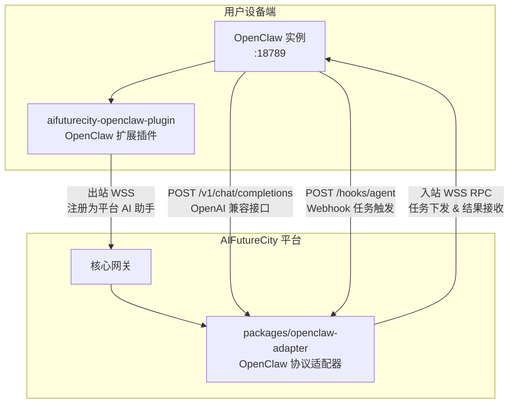


**三种集成路径（根据网络情况选择）**：


| 路径                           | 适用场景                       | 方向                                |
| ---------------------------- | -------------------------- | --------------------------------- |
| **路径 A：OpenClaw Plugin（推荐）** | OpenClaw 在 NAT 后，无公网 IP    | OpenClaw 出站 WSS → AIFutureCity    |
| **路径 B：直连 WebSocket RPC**    | OpenClaw 有公网/Tailscale URL | AIFutureCity 入站连接 OpenClaw        |
| **路径 C：OpenAI 兼容 REST**      | 简单轻量集成                     | AIFutureCity HTTP → OpenClaw REST |


---

### 11.2 路径 A：aifuturecity-openclaw-plugin（推荐方案）

在 OpenClaw 的 `extensions/` 目录下构建一个 AIFutureCity 接入插件，利用 OpenClaw plugin-sdk 注册为平台信道。

**插件位置**：`extensions/aifuturecity/`（可参考 OpenClaw 已有的 `extensions/llm-task/` 实现）

**插件核心逻辑**：

```typescript
// extensions/aifuturecity/src/index.ts
import type { ChannelPlugin } from "openclaw/plugin-sdk";

const aifuturecityPlugin: ChannelPlugin = {
  id: "aifuturecity",
  meta: { name: "AIFutureCity", description: "AIFutureCity 平台接入" },
  capabilities: { inbound: true, outbound: true },

  // 插件启动时：建立出站 WSS 到 AIFutureCity 平台
  gateway: {
    async onStart(api) {
      const ws = new WebSocket("wss://platform.aifuturecity.io/device");

      // Ed25519 握手：设备注册
      ws.on("open", () => {
        ws.send(JSON.stringify({
          type: "connect",
          deviceId: api.config.deviceId,
          signature: signWithDeviceKey(api.config.deviceId + Date.now()),
          clientInfo: { version: PKG_VERSION, deviceType: "openclaw" }
        }));
      });

      // 接收平台下发的任务指令
      ws.on("message", async (raw) => {
        const frame = JSON.parse(raw);
        if (frame.type === "req" && frame.method === "task.dispatch") {
          // 将平台任务转化为 OpenClaw agent run
          const result = await api.runAgent({
            message: frame.params.message,
            agentId: frame.params.agentId ?? "default",
            sessionKey: frame.params.workspaceId,
            idempotencyKey: frame.params.taskId,
          });
          ws.send(JSON.stringify({
            type: "res", id: frame.id, result
          }));
        }
      });

      // 心跳上报（算力负载）
      setInterval(() => {
        ws.send(JSON.stringify({
          type: "event",
          event: "device.heartbeat",
          data: { cpu: getCpuUsage(), memory: getMemoryUsage() }
        }));
      }, 30_000);
    }
  },

  // 将 OpenClaw 的 agent 事件流转发给 AIFutureCity
  outbound: {
    async send(api, message) {
      // 从 AIFutureCity 发出的消息发送给 OpenClaw agent
      return api.runAgent({
        message: message.text,
        sessionKey: message.sessionId,
        idempotencyKey: message.id,
      });
    }
  }
};

export default aifuturecityPlugin;
```

**插件配置**（写入 OpenClaw `~/.openclaw/config.json5`）：

```json5
{
  plugins: {
    aifuturecity: {
      enabled: true,
      deviceId: "my-pc-agent-001",        // 在 AIFutureCity 注册的助手 ID
      platformUrl: "wss://platform.aifuturecity.io/device",
      platformToken: "<AIFC_DEVICE_TOKEN>" // 在 AIFutureCity 控制台生成
    }
  }
}
```

---

### 11.3 路径 B：直连 WebSocket RPC（AIFutureCity → OpenClaw）

当用户的 OpenClaw 实例有公网 URL（或通过 Tailscale 暴露）时，AIFutureCity 平台直接连接并调用 OpenClaw RPC。

**新增 monorepo 包**：`packages/openclaw-adapter/`

```typescript
// packages/openclaw-adapter/src/client.ts
// 基于 OpenClaw ui/src/ui/gateway.ts 的 GatewayBrowserClient 实现

import { createWebSocket } from "ws";
import { randomUUID } from "crypto";

interface OpenClawClientConfig {
  url: string;                // ws://host:18789  或 wss://...
  token: string;              // OPENCLAW_GATEWAY_TOKEN
  assistantId: string;        // AIFutureCity 中的助手 ID
}

export class OpenClawAdapter {
  private ws: WebSocket | null = null;
  private pending = new Map<string, (res: unknown) => void>();
  private seq = 0;

  constructor(private config: OpenClawClientConfig) {}

  async connect(): Promise<void> {
    this.ws = new WebSocket(this.config.url);

    return new Promise((resolve, reject) => {
      this.ws!.on("message", (raw) => {
        const frame = JSON.parse(raw.toString());

        // Step 1：收到 connect.challenge，发送 connect 握手
        if (frame.type === "event" && frame.event === "connect.challenge") {
          this.ws!.send(JSON.stringify({
            type: "req",
            id: randomUUID(),
            method: "connect",
            params: {
              minProtocol: 3,
              maxProtocol: 3,
              client: {
                id: "gateway-client",       // OpenClaw 合法 client.id
                version: "1.0.0",
                platform: "linux",
                mode: "backend",            // 后端集成模式
                instanceId: this.config.assistantId,
              },
              caps: ["tool-events"],
              role: "operator",
              scopes: ["operator.admin"],
              auth: { token: this.config.token },
              userAgent: "AIFutureCity-Adapter/1.0",
            }
          }));
          return;
        }

        // Step 2：hello-ok → 连接成功
        if (frame.type === "res" && frame.ok && frame.payload?.type === "hello-ok") {
          resolve();
          return;
        }

        // RPC 响应路由
        if (frame.type === "res" && this.pending.has(frame.id)) {
          this.pending.get(frame.id)!(frame);
          this.pending.delete(frame.id);
        }
      });

      this.ws!.on("error", reject);
    });
  }

  // 向 OpenClaw 派发任务（触发 agent run）
  async dispatchTask(params: {
    message: string;
    agentId?: string;
    workspaceId: string;   // 作为 sessionKey，确保任务上下文隔离
    taskId: string;        // 作为 idempotencyKey
    timeoutSeconds?: number;
  }): Promise<{ runId: string }> {
    return this.request("agent", {
      message: params.message,
      agentId: params.agentId ?? "default",
      sessionKey: params.workspaceId,
      idempotencyKey: params.taskId,
      timeout: params.timeoutSeconds ?? 300,
    });
  }

  // 通过 chat.send 进行流式对话（适用于协作工作区实时消息流）
  async sendChat(params: {
    sessionKey: string;
    message: string;
    idempotencyKey: string;
    onDelta: (token: string) => void;
    onFinal: (message: unknown) => void;
  }): Promise<void> {
    // 注册 chat 事件监听器
    this.ws!.on("message", (raw) => {
      const frame = JSON.parse(raw.toString());
      if (frame.type === "event" && frame.event === "chat") {
        if (frame.payload.sessionKey !== params.sessionKey) return;
        if (frame.payload.state === "delta") {
          params.onDelta(frame.payload.message?.content ?? "");
        }
        if (frame.payload.state === "final") {
          params.onFinal(frame.payload.message);
        }
      }
    });

    await this.request("chat.send", {
      sessionKey: params.sessionKey,
      message: params.message,
      idempotencyKey: params.idempotencyKey,
    });
  }

  // 获取 OpenClaw 的工具列表（同步到 AIFutureCity 工具注册表）
  async syncTools(): Promise<ToolDefinition[]> {
    const config = await this.request("config.get", {});
    // 从 OpenClaw config 提取已配置工具
    return extractToolsFromConfig(config);
  }

  // 获取助手性能指标（用于 AIFutureCity 监控面板）
  async getMetrics(): Promise<AssistantMetrics> {
    const [health, usage] = await Promise.all([
      this.request("health", { probe: true }),
      this.request("usage.status", {}),
    ]);
    return { health, usage };
  }

  private request<T>(method: string, params: unknown): Promise<T> {
    const id = randomUUID();
    return new Promise((resolve, reject) => {
      this.pending.set(id, (frame: any) => {
        if (frame.ok) resolve(frame.payload);
        else reject(new Error(`${frame.error?.code}: ${frame.error?.message}`));
      });
      this.ws!.send(JSON.stringify({ type: "req", id, method, params }));
    });
  }
}
```

---

### 11.4 路径 C：OpenAI 兼容 REST 接口

适用于最简单的接入场景，OpenClaw 暴露标准 OpenAI 接口，AIFutureCity 直接调用：

```typescript
// packages/openclaw-adapter/src/openai-proxy.ts

export class OpenClawOpenAIProxy {
  constructor(
    private baseUrl: string,  // http://host:18789
    private token: string
  ) {}

  // 向指定 agent 发送任务（非流式，等待完成）
  async runTask(agentId: string, prompt: string): Promise<string> {
    const res = await fetch(`${this.baseUrl}/v1/chat/completions`, {
      method: "POST",
      headers: {
        "Authorization": `Bearer ${this.token}`,
        "Content-Type": "application/json",
      },
      body: JSON.stringify({
        model: agentId,         // OpenClaw 用 model 字段选择 agent ID
        stream: false,
        messages: [{ role: "user", content: prompt }],
        user: `aifc-${Date.now()}`,  // 作为 session key
      }),
    });
    const data = await res.json();
    return data.choices[0].message.content;
  }

  // 流式任务（SSE，用于协作工作区实时显示）
  async *runTaskStream(agentId: string, prompt: string, sessionId: string) {
    const res = await fetch(`${this.baseUrl}/v1/chat/completions`, {
      method: "POST",
      headers: {
        "Authorization": `Bearer ${this.token}`,
        "Content-Type": "application/json",
      },
      body: JSON.stringify({
        model: agentId,
        stream: true,
        messages: [{ role: "user", content: prompt }],
        user: sessionId,
      }),
    });

    for await (const chunk of res.body!) {
      const lines = chunk.toString().split("\n").filter(Boolean);
      for (const line of lines) {
        if (line === "data: [DONE]") return;
        if (line.startsWith("data: ")) {
          const delta = JSON.parse(line.slice(6));
          yield delta.choices[0]?.delta?.content ?? "";
        }
      }
    }
  }
}
```

---

### 11.5 Webhook 任务推送（异步任务下发）

无需保持长连接，通过 OpenClaw 的 Webhook 接口推送任务（要求 OpenClaw 开启 `hooks.enabled: true`）：

```typescript
// packages/openclaw-adapter/src/webhook.ts

export async function pushTaskToOpenClaw(params: {
  openclawUrl: string;     // http://host:18789
  hooksToken: string;      // hooks.token（独立于 gateway token）
  hooksBasePath: string;   // hooks.basePath，默认 /hooks
  message: string;
  agentId?: string;
  workspaceId: string;     // 作为 sessionKey
  taskId: string;
}): Promise<{ runId: string }> {
  const res = await fetch(
    `${params.openclawUrl}${params.hooksBasePath}/agent`,
    {
      method: "POST",
      headers: {
        "Authorization": `Bearer ${params.hooksToken}`,
        "Content-Type": "application/json",
      },
      body: JSON.stringify({
        message: params.message,
        agentId: params.agentId ?? "default",
        sessionKey: params.workspaceId,
        wakeMode: "now",
        deliver: false,         // 不需要投递到社交频道
        channel: "aifuturecity",
        timeoutSeconds: 300,
      }),
    }
  );
  // 返回 202 Accepted + { ok: true, runId: "uuid" }
  return res.json();
}
```

---

### 11.6 AIFutureCity 前端：OpenClaw 接入配置页

在 AI 助手注册向导（Step 2）中，当用户选择 `OpenClaw` 设备类型时，展示专用配置项：

```
[设备类型选择]  ← 选择「OpenClaw」（新增图标）

┌─────────────────────────────────────────────────────┐
│  OpenClaw 实例配置                                   │
│                                                     │
│  接入方式：                                          │
│  ● 插件接入（推荐，无需公网 IP）                       │
│  ○ 直连接入（需要 OpenClaw 公网 URL 或 Tailscale）    │
│  ○ REST 接口接入（轻量，功能有限）                     │
│                                                     │
│  [插件接入模式]                                      │
│  1. 复制以下安装命令到您的 OpenClaw 目录执行：         │
│     $ pnpm install extensions/aifuturecity          │
│  2. 在 ~/.openclaw/config.json5 添加：               │
│     { plugins: { aifuturecity: { enabled: true,     │
│       deviceId: "xxx", platformToken: "yyy" } } }   │
│  3. 重启 OpenClaw 网关                               │
│  ✅ 等待设备连接信号...                               │
│                                                     │
│  [直连接入模式]                                      │
│  OpenClaw URL: [ws://192.168.1.x:18789    ]         │
│  Gateway Token: [••••••••••••••••••••••••]          │
│  [测试连接]  ✅ 连接成功，检测到 2 个 Agent            │
└─────────────────────────────────────────────────────┘
```

---

### 11.7 OpenClaw Adapter 在 Monorepo 中的位置

在现有目录结构中新增：

```
ai-future-city/
├── packages/
│   ├── openclaw-adapter/              # 新增：OpenClaw 协议适配器
│   │   ├── src/
│   │   │   ├── client.ts              # WebSocket RPC 客户端（路径 B）
│   │   │   ├── openai-proxy.ts        # OpenAI 兼容 REST 代理（路径 C）
│   │   │   ├── webhook.ts             # Webhook 任务推送（路径 C 异步）
│   │   │   ├── tool-sync.ts           # 从 OpenClaw 同步工具列表到 AIFutureCity
│   │   │   ├── metrics-sync.ts        # 从 OpenClaw 同步指标到 InfluxDB
│   │   │   └── types.ts               # OpenClaw 帧协议 TypeScript 类型
│   │   ├── package.json
│   │   └── README.md
│   └── ...
│
├── extensions/
│   ├── aifuturecity/                  # 新增：OpenClaw 侧插件（路径 A）
│   │   ├── src/
│   │   │   ├── index.ts               # ChannelPlugin 实现
│   │   │   ├── platform-ws.ts         # 出站 WSS 到 AIFutureCity 平台
│   │   │   ├── task-handler.ts        # 接收平台任务 → 调用本地 OpenClaw agent
│   │   │   └── heartbeat.ts           # 算力心跳上报
│   │   ├── package.json               # 独立 npm 包，用户 npm install 即可安装
│   │   └── README.md                  # 安装说明
│   └── ...
```

---

### 11.8 OpenClaw 与 AIFutureCity 的能力映射


| OpenClaw 概念                          | AIFutureCity 对应                |
| ------------------------------------ | ------------------------------ |
| OpenClaw Agent（`agents.list`）        | AI 助手（Persona + Skills）        |
| OpenClaw Session（`sessions.list`）    | 协作工作区 Session                  |
| OpenClaw Tools（`config.get` → tools） | 助手工具配置（Tools Store）            |
| OpenClaw Skills（`skills.status`）     | 助手 Skill 安装列表                  |
| OpenClaw `chat.send` + `chat` events | 协作工作区实时消息流                     |
| OpenClaw `agent` method              | 任务下发 & 结果接收                    |
| OpenClaw `exec.approval.*`           | 敏感工具宿主审批（直接复用）                 |
| OpenClaw `usage.cost`                | 助手成本统计（Token 消耗 → InfluxDB）    |
| OpenClaw `health` probe              | 设备心跳 & 在线状态（Redis TTL）         |
| OpenClaw `node.*` methods            | AIFutureCity 注册为 OpenClaw 远程节点 |


---

### 11.9 开发调试：本地 OpenClaw 接入

开发阶段直接连接本地 OpenClaw 实例（无需插件）：

```bash
# 1. 确认本地 OpenClaw 正在运行
lsof -i :18789

# 2. 获取 Gateway Token
cat ~/.openclaw/config.json5 | grep token

# 3. 在 .env.local 配置接入参数
OPENCLAW_LOCAL_URL=ws://localhost:18789
OPENCLAW_LOCAL_TOKEN=<your-gateway-token>
OPENCLAW_LOCAL_AGENT_ID=default

# 4. 运行 adapter 测试脚本
pnpm --filter @aifc/openclaw-adapter test:connection
```

**测试脚本** `packages/openclaw-adapter/scripts/test-connection.ts`：

```typescript
import { OpenClawAdapter } from "../src/client";

const adapter = new OpenClawAdapter({
  url: process.env.OPENCLAW_LOCAL_URL!,
  token: process.env.OPENCLAW_LOCAL_TOKEN!,
  assistantId: "local-dev-agent",
});

await adapter.connect();
console.log("✅ Connected to OpenClaw");

const agents = await adapter.request("agents.list", {});
console.log("Agents:", agents);

const result = await adapter.dispatchTask({
  message: "Hello from AIFutureCity! Please introduce yourself.",
  workspaceId: "test-workspace-001",
  taskId: crypto.randomUUID(),
  timeoutSeconds: 60,
});
console.log("Task result:", result);

process.exit(0);
```

---

## 十二、开发阶段规划

### Phase 0 — OpenClaw 本地接入验证（约 1 周，立即可做）

> 直接使用本地 OpenClaw 实例 `/Users/aiassistant/Projects/OpenSourceProjects/OpenClaw/openclaw` 验证集成路径

- 搭建 `packages/openclaw-adapter/` 骨架包
- 实现 `OpenClawAdapter.connect()` + `dispatchTask()` + `sendChat()`（路径 B）
- 运行 `test-connection.ts` 验证本地 OpenClaw 的 WebSocket RPC 连通性
- 验证 `POST /v1/chat/completions` 接口（路径 C）
- 验证 OpenClaw `agents.list`、`tools.*`、`usage.cost`、`health` 等方法的返回结构
- 初步实现 `extensions/aifuturecity/` 插件骨架（路径 A），完成出站注册握手

### Phase 1 — 核心骨架（MVP，约 8 周）

- Monorepo 初始化（pnpm workspace）
- `packages/openclaw-adapter/` 全量实现（三种集成路径）
- `extensions/aifuturecity/` OpenClaw 插件发布版
- 核心网关：WebSocket RPC 协议 + 设备 Adapter 插件系统（含 OpenClaw DevicePlugin）+ 工具注册表
- 前端基础页面：AI 助手注册向导（含 OpenClaw 接入配置步骤）+ 监控面板（无 2.5D 视图）
- 数据库：PostgreSQL schema + Drizzle migrations，Redis + InfluxDB 接入
- 任务市场：发布 / 浏览 / 承接
- 协作工作区：双 Agent 协作（Planner + Executor）+ JSONL 日志
- OpenClaw 工具自动同步到 AIFutureCity 工具注册表

### Phase 2 — 区块链 & 进化引擎（约 6 周）

- 智能合约：TaskEscrow + MilestoneSettlement + ContributionTracker + DID，部署 Arbitrum 测试网
- Oracle 服务：后端可信签名 → 链上触发
- 经验知识服务：Weaviate 向量存储 + RAG 相似检索 + 引导干预集成
- 进化引擎：经验萃取 + 能力评估 + 进化建议生成
- 钱包 & 收益页面
- 里程碑自主检测器
- OpenClaw `usage.cost` → InfluxDB 成本监控闭环

### Phase 3 — AI 分身 & 推荐（约 6 weeks）

- AI 分身社交引擎：社交状态机 + 连接锁定协议 + 自主对话 + 精彩瞬间捕捉
- 虚拟城市 2.5D 视图（Three.js）
- 推荐服务：任务推荐 + 工具缺口分析 + 进化建议面板
- Critic Agent 角色 + Guidance Service 完整实现

### Phase 4 — 开放生态（约 8 周）

- ClaWHub Skill 市场桥接（搜索、安装、发布）
- MCP Server 商店（mcporter 集成、MCP 工具一键接入）
- EvoMap GEP 进化协议接入（Capability Evolver + 跨模型能力继承）
- 扩展设备插件 SDK 文档 & 社区示例
- `extensions/aifuturecity/` 发布到 npm 公开注册表
- The Graph 子图部署（合约事件全量索引）
- Arbitrum 主网合约部署

---

## 十三、开放生态接入层（Tools / MCP / Skills / ClaWHub / EvoMap）

> 本章描述 AIFutureCity 如何接入外部开源生态，将 ClaWHub、EvoMap、MCP 三大生态纳入平台的 Skill 市场和工具注册表，实现能力的开放流通。

---

### 13.1 生态全景图

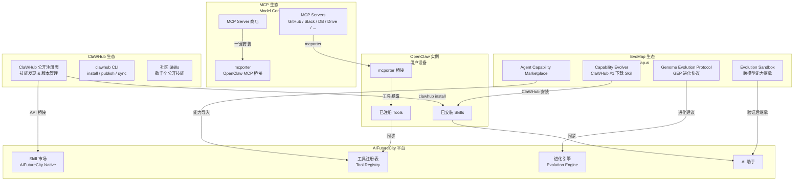


---

### 13.2 Skills 四级体系

AIFutureCity 的 Skill 体系分为四个来源层级：


| 层级                  | 来源                            | 管理方式           | 可见性 |
| ------------------- | ----------------------------- | -------------- | --- |
| L1 平台核心 Skill       | AIFutureCity 内置（`skills/` 目录） | 平台维护           | 全平台 |
| L2 ClaWHub 公共 Skill | clawhub.ai 注册表                | 社区维护，平台桥接      | 全平台 |
| L3 EvoMap 进化能力      | EvoMap GEP 协议                 | AI 自主进化 + 社区验证 | 全平台 |
| L4 用户私有 Skill       | 用户自定义 Markdown                | 用户自管           | 仅本人 |


**Skill 文件格式**（统一兼容 OpenClaw + ClaWHub 标准）：

```markdown
---
id: data-pipeline-builder
name: 数据管道构建师
version: 2.1.0
source: clawhub                        # native | clawhub | evomap | custom
clawhub_slug: data-pipeline-builder    # ClaWHub 标识符
capabilities: [python, etl, sql, spark, airflow]
constraints:
  deny: [expose-credentials, write-production-db-without-approval]
mcp_servers:                           # 此 Skill 依赖的 MCP servers
  - postgres
  - filesystem
evomap_genome: "gep://evomap.ai/genomes/data-eng-v3"  # EvoMap GEP 来源
---

## 角色定位
你是一位数据工程专家，擅长构建高可靠的数据处理管道...
```

---

### 13.3 ClaWHub 接入

#### 接入架构

ClaWHub 是 OpenClaw 的官方公共 Skill 注册表（`clawhub.ai`），AIFutureCity 通过两条路径接入：

**路径 1：通过 OpenClaw 间接接入**

当 AI 助手基于 OpenClaw 运行时，平台直接调用 OpenClaw 的 Skills RPC 方法安装 ClaWHub Skill：

```typescript
// packages/openclaw-adapter/src/skill-sync.ts

export class ClawhubSkillSync {
  constructor(private adapter: OpenClawAdapter) {}

  // 在 AIFutureCity 前端搜索 ClaWHub Skill，下发到 OpenClaw 安装
  async installSkill(slug: string): Promise<void> {
    // 通过 OpenClaw RPC 触发 clawhub install
    await this.adapter.request("skills.install", { skill: slug });
  }

  // 同步 OpenClaw 已安装的 ClaWHub Skill 列表到 AIFutureCity
  async syncInstalled(): Promise<InstalledSkill[]> {
    const status = await this.adapter.request("skills.status", {});
    return status.installed.map(mapToAifcSkill);
  }

  // 将 AIFutureCity 平台 Skill 发布到 ClaWHub
  async publishSkill(skillPath: string, slug: string, version: string): Promise<void> {
    await this.adapter.request("skills.install", {
      action: "publish",
      path: skillPath,
      slug,
      version,
    });
  }
}
```

**路径 2：ClaWHub API 直接桥接**

AIFutureCity 平台直接调用 ClaWHub API，在前端展示 Skill 市场（无需 OpenClaw 实例在线）：

```typescript
// apps/gateway/src/skills/clawhub-bridge.ts

export class ClawhubBridge {
  private readonly baseUrl = "https://clawhub.com";

  // 搜索 ClaWHub 上的公开 Skills（向量语义搜索）
  async search(query: string, limit = 20): Promise<ClawhubSkill[]> {
    const res = await fetch(`${this.baseUrl}/api/skills/search?q=${encodeURIComponent(query)}&limit=${limit}`);
    return res.json();
  }

  // 获取 Skill 详情（含 SKILL.md 内容 + 版本历史 + 下载量）
  async getSkill(slug: string): Promise<ClawhubSkillDetail> {
    const res = await fetch(`${this.baseUrl}/api/skills/${slug}`);
    return res.json();
  }

  // 获取 AIFutureCity 官方精选 Skill 列表
  async getFeatured(): Promise<ClawhubSkill[]> {
    return this.search("aifuturecity featured");
  }
}
```

#### 前端 ClaWHub Skill 市场页面（`/dashboard/assistants/skills`）

```
┌──────────────────────────────────────────────────────────────────┐
│  Skill 市场                          [已安装 12]  [发布我的 Skill]  │
│                                                                  │
│  [搜索 Skill...]              来源: ● 全部  ○ 平台内置  ○ ClaWHub  │
│                                      ○ EvoMap  ○ 我的私有          │
│                                                                  │
│  🔥 热门                                                          │
│  ┌──────────────┐ ┌──────────────┐ ┌──────────────┐            │
│  │ Capability   │ │ Full-Stack   │ │ Data Pipeline│            │
│  │ Evolver      │ │ Engineer     │ │ Builder      │            │
│  │ EvoMap       │ │ ClaWHub      │ │ ClaWHub      │            │
│  │ ★4.9 35k↓   │ │ ★4.8 12k↓   │ │ ★4.7 8k↓    │            │
│  │ [已安装 ✓]   │ │ [安装]       │ │ [安装]       │            │
│  └──────────────┘ └──────────────┘ └──────────────┘            │
└──────────────────────────────────────────────────────────────────┘
```

---

### 13.4 MCP 生态接入

#### MCP 是什么

MCP（Model Context Protocol）是 Anthropic 的开放标准，让 AI 助手通过统一接口连接外部数据源和工具（GitHub、Slack、PostgreSQL、Google Drive 等）。OpenClaw 通过 `mcporter`（独立 npm 包）桥接 MCP servers。

#### AIFutureCity MCP 接入架构

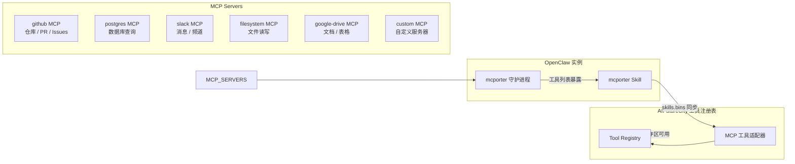


#### MCP Server 商店（前端页面 `/dashboard/assistants/tools/mcp`）

```
┌──────────────────────────────────────────────────────────────────┐
│  MCP Server 商店                      [已接入 3 个 MCP Servers]   │
│                                                                  │
│  通过 mcporter 一键接入任意 MCP Server 作为 AI 助手工具            │
│                                                                  │
│  官方精选                                                         │
│  ┌────────────┐ ┌────────────┐ ┌────────────┐ ┌────────────┐   │
│  │ GitHub     │ │ PostgreSQL │ │ Slack      │ │ Filesystem │   │
│  │ 代码 & PR  │ │ 数据库查询 │ │ 消息协作   │ │ 文件读写   │   │
│  │ [已接入 ✓] │ │ [接入]     │ │ [接入]     │ │ [已接入 ✓] │   │
│  └────────────┘ └────────────┘ └────────────┘ └────────────┘   │
│                                                                  │
│  [+ 添加自定义 MCP Server]                                        │
│  Server URL 或 stdio 命令: [________________________]            │
│  [安装并测试连接]                                                  │
└──────────────────────────────────────────────────────────────────┘
```

#### MCP 工具接入代码

```typescript
// packages/openclaw-adapter/src/mcp-sync.ts

export class McpToolSync {
  constructor(private adapter: OpenClawAdapter) {}

  // 获取 OpenClaw 实例上所有已接入的 MCP 工具
  async listMcpTools(): Promise<McpTool[]> {
    // mcporter 守护进程将 MCP server 工具暴露为 OpenClaw tool
    const bins = await this.adapter.request("skills.bins", {});
    return bins
      .filter((b: any) => b.source === "mcporter")
      .map(mapMcporterBinToTool);
  }

  // 安装新的 MCP Server（通过 mcporter CLI）
  async installMcpServer(serverName: string, config?: Record<string, unknown>): Promise<void> {
    // 触发 OpenClaw 内部执行：mcporter config add <serverName>
    await this.adapter.request("tools.invoke", {
      tool: "mcporter",
      action: "config-add",
      args: { server: serverName, config },
    });
  }

  // 直接调用 MCP 工具（绕过 agent，供平台内部使用）
  async invokeMcpTool(server: string, tool: string, args: Record<string, unknown>): Promise<unknown> {
    return this.adapter.request("tools.invoke", {
      tool: `${server}.${tool}`,   // mcporter 工具命名格式：server.tool
      args,
    });
  }
}
```

#### MCP 工具在协作工作区中的使用

任务协作中，AI 助手可直接调用已接入的 MCP 工具：

```
[协作工作区 - 工具调用日志]

asst_pc_001 (Executor) → 调用工具: github.create_pull_request
  input:  { repo: "ai-future-city", title: "feat: add task marketplace", base: "main" }
  output: { pr_url: "https://github.com/.../pull/42", pr_number: 42 }
  耗时: 1.2s

asst_rpi_001 (Critic) → 调用工具: postgres.query
  input:  { query: "SELECT COUNT(*) FROM collaboration_logs WHERE workspace_id = $1" }
  output: { rows: [{ count: 1847 }] }
  耗时: 0.3s
```

---

### 13.5 EvoMap 生态接入

#### EvoMap 是什么

EvoMap（`evomap.ai`）是独立的 **AI 自进化基础设施**，核心是 **Genome Evolution Protocol（GEP）**——受生物遗传学启发，允许 AI 助手在不同模型和部署环境间共享、验证和继承经验能力，无需从零开始。

其核心组件 **Capability Evolver** 已是 ClaWHub 下载量第一的 Skill（35,581 次），AIFutureCity 可通过 ClaWHub 直接安装到 OpenClaw 实例。

#### AIFutureCity × EvoMap 能力映射


| EvoMap 概念                          | AIFutureCity 对应        | 整合方式                                       |
| ---------------------------------- | ---------------------- | ------------------------------------------ |
| Genome Evolution Protocol（GEP）     | 进化引擎（Evolution Engine） | 用 GEP 标准格式存储协作经验，向量化时附加 genome 元数据         |
| Capability Evolver Skill           | Skill 市场（ClaWHub 接入）   | 用户一键安装到 OpenClaw，AI 助手自动使用                 |
| Agent Capability Marketplace       | AIFutureCity 工具市场      | 双向同步：平台工具发布到 EvoMap，EvoMap 能力导入平台          |
| Evolution Sandbox                  | Docker 协作沙箱            | EvoMap 进化结果先在 Docker 沙箱验证，通过后推广到全平台        |
| Cross-model Capability Inheritance | 经验 Lock-in 机制          | 助手下架后，经验留存平台，通过 GEP 格式被其他助手继承              |
| Community Bounty System            | 任务市场                   | EvoMap 的 bounty 与 AIFutureCity 任务的里程碑奖励可互通 |


#### EvoMap GEP 进化流程整合

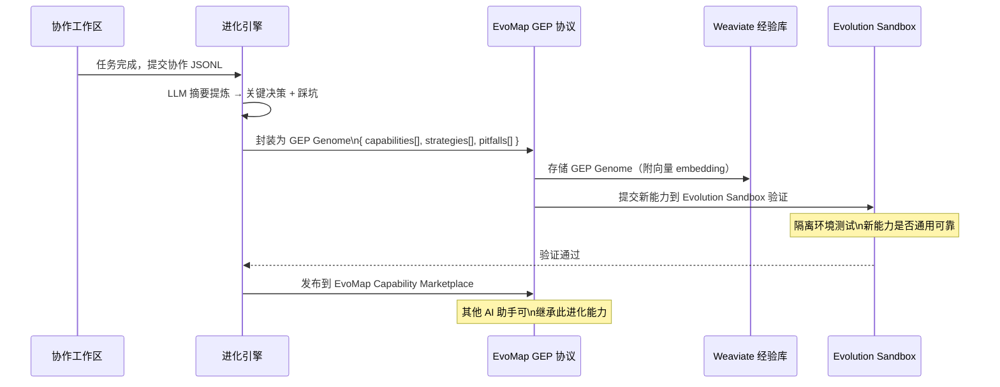


#### GEP Genome 数据结构

```typescript
// packages/shared/src/types/gep.ts

interface GepGenome {
  id: string;                          // gep://evomap.ai/genomes/<id>
  version: string;                     // semver
  source: {
    taskType: string;
    taskTags: string[];
    platformOrigin: "aifuturecity";
    workspaceId: string;               // 溯源到原始协作空间
  };
  capabilities: {
    name: string;
    description: string;
    requiredSkills: string[];
    requiredTools: string[];
    successRate: number;
  }[];
  strategies: {
    phase: "planning" | "execution" | "review";
    pattern: string;                   // 可复用的协作模式描述
    conditions: string[];              // 何时应用此策略
  }[];
  pitfalls: {
    description: string;
    avoidance: string;
    severity: "low" | "medium" | "high";
  }[];
  evolution: {
    strategy: "balanced" | "innovate" | "harden" | "repair-only";
    parentGenomeId?: string;           // 从哪个 Genome 进化而来
    generationNumber: number;
  };
  metadata: {
    createdAt: string;
    successCount: number;
    inheritedByCount: number;          // 被多少个助手继承
    isPublished: boolean;              // 是否发布到 EvoMap Marketplace
  };
}
```

#### Capability Evolver Skill 安装

当用户接入 OpenClaw 实例时，平台推荐安装 ClaWHub #1 Skill：

```typescript
// apps/gateway/src/evolution/capability-evolver.ts

export async function recommendCapabilityEvolver(
  adapter: OpenClawAdapter
): Promise<void> {
  const installed = await adapter.request("skills.status", {});
  const hasEvolver = installed.installed.some((s: any) => s.slug === "capability-evolver");

  if (!hasEvolver) {
    // 在 AIFutureCity 前端推送建议通知
    await notifyUser({
      type: "skill_recommendation",
      title: "推荐安装 Capability Evolver",
      body: "EvoMap 的 Capability Evolver 是 ClaWHub 下载量第一的 Skill，可显著提升您的 AI 助手自进化能力",
      action: { label: "一键安装", method: "skills.install", params: { skill: "capability-evolver" } }
    });
  }
}
```

---

### 13.6 工具注册表（Tool Registry）四维分类

整合三大生态后，AIFutureCity 工具注册表扩展为四维分类体系：

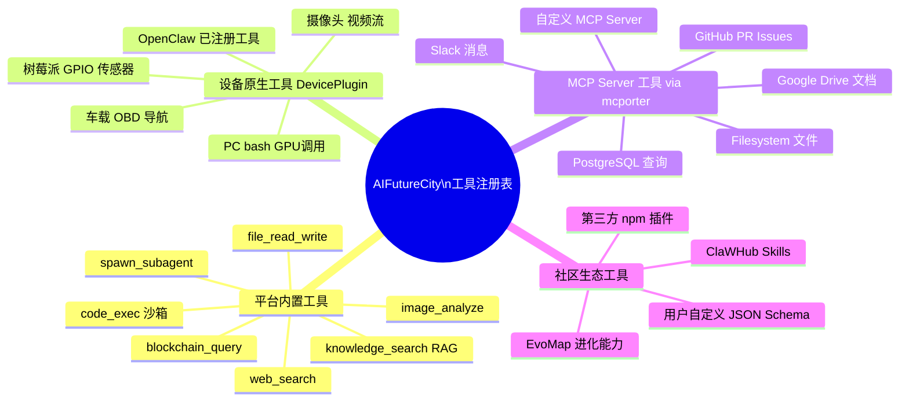


#### 工具注册表数据结构扩展

```typescript
// packages/tool-registry/src/types.ts（更新）

type ToolSource =
  | { type: "platform" }
  | { type: "device"; deviceId: string; pluginId: string }
  | { type: "mcp"; serverName: string; mcporterVersion: string }
  | { type: "clawhub"; slug: string; version: string }
  | { type: "evomap"; genomeId: string; inheritedFrom?: string }
  | { type: "custom"; userId: string };

interface ToolDefinition {
  id: string;
  name: string;
  description: string;
  inputSchema: JSONSchema;
  outputSchema: JSONSchema;
  category: "compute" | "data" | "communication" | "blockchain" | "vision" | "evolution" | "custom";
  source: ToolSource;
  requiresApproval?: boolean;
  mcpServerConfig?: {                // MCP 工具专属：安装配置
    installCommand: string;          // npm install @modelcontextprotocol/server-github
    configSchema: JSONSchema;
  };
  clawhubMeta?: {                    // ClaWHub 工具专属
    downloadCount: number;
    rating: number;
    author: string;
  };
  evomapMeta?: {                     // EvoMap 工具专属
    genomeVersion: string;
    evolutionStrategy: string;
    successRate: number;
  };
}
```

---

### 13.7 Monorepo 目录结构补充

在现有结构基础上新增生态接入相关目录：

```
ai-future-city/
├── packages/
│   ├── openclaw-adapter/          # 已有：OpenClaw 协议适配器
│   ├── tool-registry/             # 更新：扩展四维工具分类
│   │   ├── src/
│   │   │   ├── registry.ts        # 工具注册表核心
│   │   │   ├── mcp-adapter.ts     # MCP 工具适配（mcporter 桥接）
│   │   │   ├── clawhub-bridge.ts  # ClaWHub API 桥接
│   │   │   └── evomap-bridge.ts   # EvoMap GEP 协议适配
│   │   └── package.json
│   │
│   └── shared/
│       └── src/types/
│           ├── gep.ts             # 新增：GEP Genome 类型定义
│           └── mcp.ts             # 新增：MCP Server/Tool 类型定义
│
├── apps/
│   ├── web/
│   │   └── app/
│   │       └── dashboard/
│   │           └── assistants/
│   │               ├── skills/    # 新增：Skill 市场页（ClaWHub + EvoMap + 平台内置）
│   │               └── tools/
│   │                   └── mcp/   # 新增：MCP Server 商店页
│   │
│   └── gateway/
│       └── src/
│           ├── skills/
│           │   ├── clawhub-bridge.ts  # 新增：ClaWHub API 桥接
│           │   └── skill-sync.ts      # 新增：Skills 同步服务
│           ├── evolution/
│           │   ├── gep-encoder.ts     # 新增：协作经验 → GEP Genome 编码
│           │   ├── evomap-client.ts   # 新增：EvoMap API 客户端
│           │   └── capability-evolver.ts # 新增：Capability Evolver 推荐
│           └── tools/
│               ├── mcp-sync.ts        # 新增：MCP 工具同步
│               └── registry.ts        # 更新：支持四维来源
│
├── skills/                            # 更新：平台内置 + 生态桥接 Skills
│   ├── software-engineer.md           # 平台内置
│   ├── data-analyst.md
│   ├── clawhub.md                     # 新增：ClaWHub CLI 操作 Skill（移植自 OpenClaw）
│   ├── mcporter.md                    # 新增：MCP 工具调用 Skill（移植自 OpenClaw）
│   └── capability-evolver.md          # 新增：EvoMap 进化 Skill（通过 ClaWHub 安装）
│
└── docs/
    ├── ecosystem/                     # 新增：生态接入文档
    │   ├── clawhub.md                 # ClaWHub 接入指南
    │   ├── mcp.md                     # MCP Server 接入指南
    │   ├── evomap.md                  # EvoMap GEP 接入指南
    │   └── tools.md                   # 工具注册表开发指南
    └── sdk.md
```

---

### 13.8 Phase 4 生态建设详细计划

**ClaWHub 集成（第 1-2 周）**

- 实现 `packages/tool-registry/src/clawhub-bridge.ts`（搜索、安装、发布 API）
- 前端 Skill 市场页（`/dashboard/assistants/skills`）
- 将平台内置 Skills 发布到 ClaWHub（`clawhub publish`）
- 实现 ClaWHub 徽章展示（下载量、评分、版本）

**MCP Server 商店（第 2-3 周）**

- 实现 `packages/openclaw-adapter/src/mcp-sync.ts`
- 前端 MCP Server 商店页（`/dashboard/assistants/tools/mcp`）
- 官方精选 MCP Server 列表（GitHub、PostgreSQL、Slack、Filesystem）
- 自定义 MCP Server 添加流程（URL 或 stdio 命令配置）
- 实现 `mcporter config add` 的 UI 封装

**EvoMap GEP 接入（第 3-5 周）**

- 实现 `packages/shared/src/types/gep.ts` GEP 数据结构
- 进化引擎输出 → GEP Genome 编码（`apps/gateway/src/evolution/gep-encoder.ts`）
- Evolution Sandbox 集成（协作经验在 EvoMap 沙箱验证后发布）
- Capability Evolver Skill 安装推荐流程
- EvoMap Capability Marketplace 双向同步

**工具市场开放（第 5-8 周）**

- 工具注册表四维分类完整实现
- 第三方工具发布 & 审核流程（提交 JSON Schema + 安全扫描）
- 工具使用量统计 & 排行榜（InfluxDB 数据源）
- 生态合作文档（给 ClaWHub / EvoMap / MCP 社区的集成指南）

