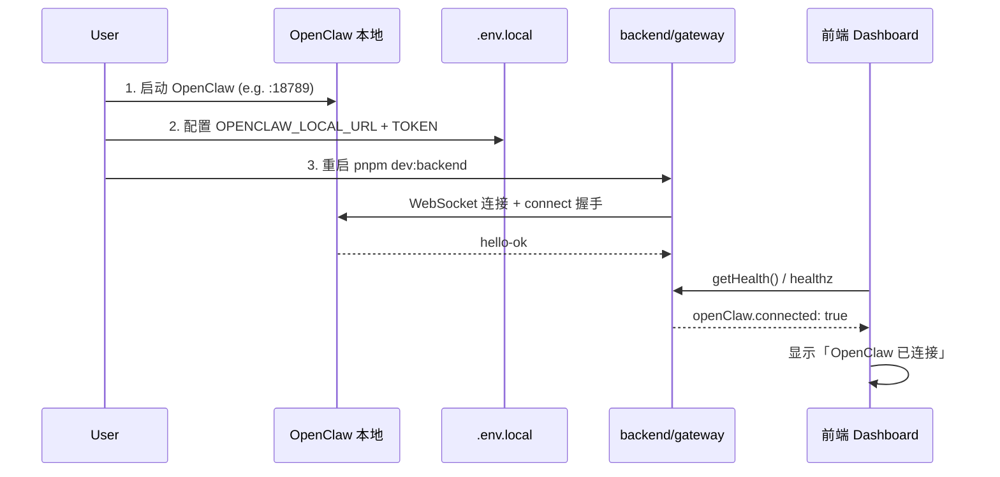
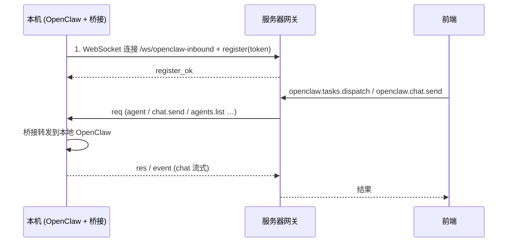

# 接入本地 OpenClaw 助手

前后端已启动后，按以下步骤接入本地 OpenClaw，使网关连接 OpenClaw 实例，前端 Dashboard 显示「OpenClaw 已连接」并可调用 `openclaw.*` RPC。

---

## 1. 在本机运行 OpenClaw

- OpenClaw 需在本地运行并监听 **WebSocket 端口**（默认 **18789**）。
- 若尚未安装/运行，请按 [OpenClaw 官方仓库](https://github.com/openclaw/openclaw) 完成安装与启动。
- 启动后确认端口在监听：

```bash
lsof -i :18789
```

---

## 2. 获取 OpenClaw Gateway Token

网关连接 OpenClaw 时需要 **Gateway Token**。常见位置（以 OpenClaw 实际配置为准）：

```bash
cat ~/.openclaw/config.json5 | grep token
```

或查阅 OpenClaw 文档中「gateway token」「认证」等说明，得到用于 WebSocket 连接的 token。

---

## 3. 在 ai-future-city 配置环境变量

在 **ai-future-city 仓库根目录** 创建或编辑 `.env.local`，增加或确认（必填前两项才会启用 OpenClaw，见 `backend/gateway/src/config/env.ts`）：

```bash
OPENCLAW_LOCAL_URL=ws://localhost:18789
OPENCLAW_LOCAL_TOKEN=<上一步拿到的 gateway token>
OPENCLAW_LOCAL_AGENT_ID=default
```

- 若 OpenClaw 未用默认端口，将 `18789` 改为实际端口。
- `OPENCLAW_LOCAL_AGENT_ID` 不填时默认为 `default`，对应 OpenClaw 中的 agent id。

可复制根目录 `.env.example` 后只填上述变量；网关启动时通过 `backend/gateway/src/config/load-local-env.ts` 读取 `.env.local`。

---

## 4. 重启网关并验证

### 4.1 重启网关

在 ai-future-city 根目录：

```bash
pnpm dev:backend
```

### 4.2 可选：脚本验证 OpenClaw 连通性

在 ai-future-city 根目录：

```bash
pnpm test:client:connection
```

或：

```bash
pnpm --dir client run test:openclaw:connection
```

脚本使用同一份 `.env.local` 连接 OpenClaw，打印 `connect`、`agents.list`、任务派发等；成功即说明协议与连接正常。

### 4.3 在前端确认

- 打开主前端（Aifuturecity）的 **控制台仪表盘**（如 `/dashboard`）。
- 顶部状态应为 **「网关正常 · OpenClaw 已连接」**。
- 若为「OpenClaw 未连接」，请检查：OpenClaw 是否在运行、`.env.local` 是否在仓库根目录、token 是否正确、网关是否已重启。

---

## 5. 接入后可用的能力

接入成功后，网关通过 `backend/gateway/src/openclaw/service.ts` 提供：

- **HTTP**：`GET /api/openclaw/agents`（`backend/gateway/src/server/http-server.ts`）
- **WebSocket RPC**：`openclaw.status`、`openclaw.agents.list`、`openclaw.tasks.dispatch`、`openclaw.chat.send` 等（`backend/gateway/src/server/method-router.ts`、`backend/gateway/src/methods/openclaw.ts`）

前端或本仓 web/console 可通过上述接口查询助手列表、派发任务、发送聊天等。

---

## 流程概览



验证通过标准：Dashboard 显示「OpenClaw 已连接」，或 `pnpm test:client:connection` 执行成功。

---

## 6. 本地个人 PC 助手接入（非 OpenClaw）

除通过 .env.local 接入 OpenClaw 外，网关支持「本地个人 PC」作为助手设备接入，并出现在 `assistants.list` / `devices.list` 中。

### 6.1 方式一：HTTP 注册

前端或脚本可先注册一个 PC 助手（默认离线，等该设备连接后变为在线）：

```bash
curl -X POST http://localhost:3001/api/assistants/register \
  -H "Content-Type: application/json" \
  -d '{"id":"my-pc-001","name":"我的电脑","kind":"pc"}'
```

- `id` 必填；`name`、`kind`（`pc`|`sdk`|`custom`）可选，默认 `kind: "pc"`。

### 6.2 方式二：WebSocket 连接时带 device 信息（即连即接入）

客户端连接网关 WebSocket 后，首次 RPC 调用 `connect` 时在 `params` 中带上 `device`，网关会将该连接注册为在线设备，断开时自动标记为离线：

```json
{ "type": "req", "id": "1", "method": "connect", "params": { "device": { "id": "my-pc-001", "name": "我的电脑", "kind": "pc" } } }
```

- `device.id` 必填；`device.name`、`device.kind` 可选。
- 同一 `id` 若已存在（例如先通过 HTTP 注册），会更新为在线并刷新 `lastSeenAt`。

### 6.3 RPC 注册

通过 WebSocket 也可调用 `assistants.register` 进行注册（与 HTTP 行为一致）：

```json
{ "type": "req", "id": "2", "method": "assistants.register", "params": { "id": "my-pc-002", "name": "办公室 PC", "kind": "pc" } }
```

接入后的 PC 助手会与 OpenClaw 返回的助手一起出现在 `assistants.list` 中，前端可统一展示与管理。

---

## 7. OpenClaw 在本地、网关在服务器（入站接入）

当 **OpenClaw 运行在你本机**、**网关运行在远端服务器** 时，无法用「网关主动连 OpenClaw」（outbound）方式，因为服务器连不到你本机的地址。改用 **入站（inbound）**：本机运行桥接脚本，**主动连到网关**，再把网关的请求转发到本机 OpenClaw。

### 7.1 服务器侧（网关）

在部署网关的机器或环境中配置 **入站用 token**（可与 outbound 共用同一 token，或单独设）：

```bash
# 仅入站时可不设 OPENCLAW_LOCAL_URL
OPENCLAW_INBOUND_TOKEN=<与桥接端约定好的 token>
# 可选：自定义入站 WebSocket 路径，默认 /ws/openclaw-inbound
# OPENCLAW_INBOUND_WS_PATH=/ws/openclaw-inbound
```

重启网关后，会监听 `OPENCLAW_INBOUND_WS_PATH`（默认 `/ws/openclaw-inbound`）。日志中会看到类似：`OpenClaw inbound: /ws/openclaw-inbound`。

### 7.2 本机（你的 PC）

1. **本机已运行 OpenClaw**（如 `ws://localhost:18789`），并已知连接用的 token。
2. 在本机 **ai-future-city 仓库** 中执行桥接脚本，并配置：
   - 网关入站 WebSocket URL（替换为你的服务器地址）
   - 与服务器一致的 `OPENCLAW_INBOUND_TOKEN`（或 `OPENCLAW_LOCAL_TOKEN`）
   - 本机 OpenClaw 的 `OPENCLAW_LOCAL_URL` 与 `OPENCLAW_LOCAL_TOKEN`

```bash
# 本机 .env.local 或环境变量示例
GATEWAY_WS_URL=wss://your-gateway-server:3001/ws/openclaw-inbound
OPENCLAW_INBOUND_TOKEN=<与服务器一致>
OPENCLAW_LOCAL_URL=ws://localhost:18789
OPENCLAW_LOCAL_TOKEN=<本机 OpenClaw token>
```

在 **client/openclaw-adapter** 下执行：

```bash
pnpm bridge:inbound
```

看到 “Registered with gateway as ...” 即表示本机 OpenClaw 已通过桥接接入网关。此时网关的 `openclaw.status` 会返回 `connected: true`、`source: "inbound"`。

### 7.3 流程概览（入站）



入站与 outbound 二选一或可并存：若已有入站连接，网关会优先使用入站；否则使用 outbound（若配置了 `OPENCLAW_LOCAL_URL`）。
