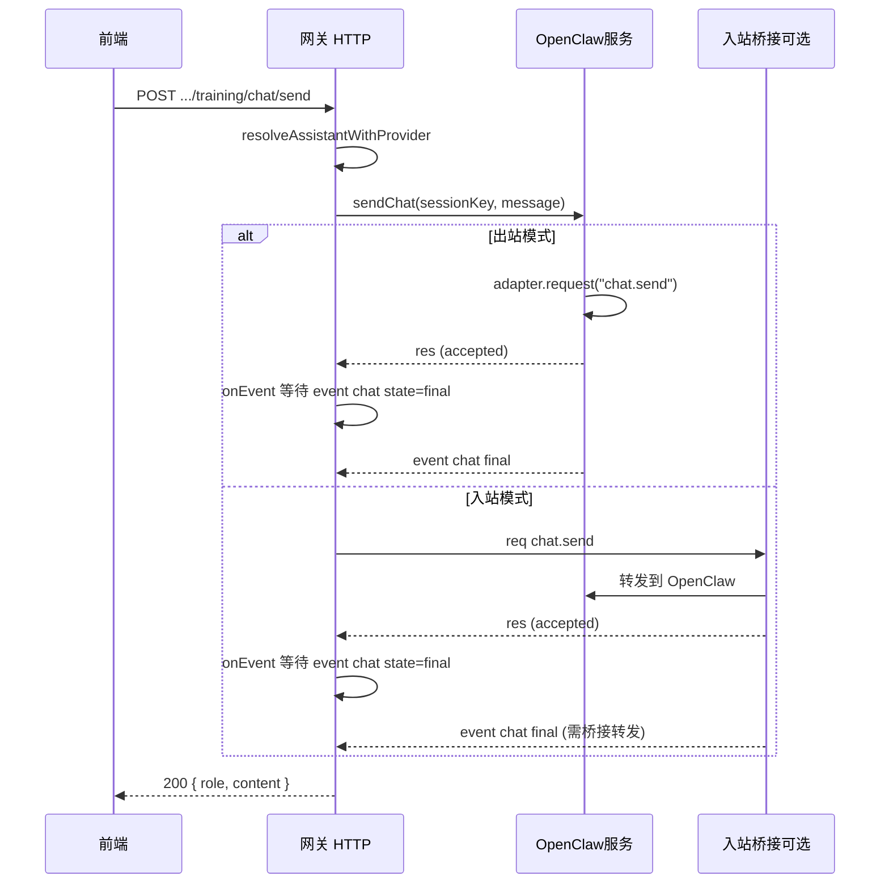

# 训练场 chat/send 无响应问题分析

当请求 `POST /api/assistants/:id/training/chat/send` 后一直收不到回复，可按本文排查。

---

## 一、请求链路

网关只有在收到 OpenClaw 侧 **`chat` 事件且 `state === "final"`** 后才会返回 200；在此之前会一直挂起。

---

## 二、可能原因

### 1. OpenClaw 从未发送 `state: "final"`（最常见）

- **出站**：网关连 OpenClaw（如 `ws://localhost:18789`），发送 `chat.send` 后等待 WebSocket 上收到 `event: "chat"` 且 `state: "final"`。若 OpenClaw 一直不发送该事件（流未结束、协议不一致、或 run 卡住），网关会一直等。
- **入站**：桥接收到 `chat.send` 后转发给 OpenClaw，网关同样等待桥接**再发回**一条 `type: "event", event: "chat"` 且 `data.state === "final"` 的帧。若桥接没有把 OpenClaw 的最终结果转成该事件并发给网关，网关也会一直等。

**结果**：最多等待 **60 秒** 后网关会超时并返回 **502**（`OpenClaw chat failed` / `Inbound OpenClaw chat timed out`）。若你“一直没收到回复”，可能是未等到 60 秒就关闭了页面或请求。

### 2. `chat.send` 的请求本身无响应

- 网关先发 `chat.send` 请求（出站为 OpenClaw，入站为桥接），需对方回一条 `type: "res"`。
- 若对方不回复或协议不对，会在 **requestTimeoutMs**（默认 **20 秒**）后失败，网关返回 502。

### 3. 助手 ID 与 OpenClaw 连接方式

- `local-openclaw-001` 来自网关侧设备种子，`provider` 为 `openclaw`，会通过校验。
- 实际对话由**当前 OpenClaw 连接**处理（出站一个连接，入站由桥接转发），与助手 ID 的对应关系取决于 OpenClaw/桥接实现；sessionKey 使用 `training-{assistantId}`，仅做会话隔离。

---

## 三、建议排查步骤

1. **确认是否等到超时**
   - 至少等待 **60 秒** 看是否出现 502。
   - 若 20 秒左右就 502，多半是 `chat.send` 的请求无响应（见上 2）。

2. **确认 OpenClaw 连接方式与状态**
   - 调 `GET /healthz`，看 `openClaw.connected` 是否为 `true`，`openClaw.source` 是 `outbound` 还是 `inbound`。

3. **出站时**（`source: "outbound"`）
   - 确认 OpenClaw 进程（如本机 `ws://localhost:18789`）已启动、版本支持 `chat.send` 且会发送 `chat` 事件（含 `state: "final"`）。
   - 用同一 URL 和 token 用 OpenClaw 官方/示例客户端发一次 chat，确认能收到完整回复。

4. **入站时**（`source: "inbound"`）
   - 确认桥接在收到网关的 `chat.send` 后：
     - 会向 OpenClaw 发起对话；
     - 并在收到 OpenClaw 的“结束”结果后，向网关发送一条事件帧：`type: "event", event: "chat"`，且 `payload` 或 `data` 中含 `sessionKey`、`state: "final"`、`message`。
   - 若桥接只回复了 `chat.send` 的 `res` 但没有转发上述 `chat` 事件，网关会一直等到 60 秒超时。

5. **看网关日志**
   - 超时或错误时会有日志；502 时错误信息会通过 `writeError` 返回，可在控制台或日志中确认是“request 超时”还是“chat final 超时”。

---

## 四、可选代码侧改进

- **缩短或可配置超时**：当前 60s 可能偏长，可改为 30s 或通过环境变量配置，便于快速失败。
- **打日志**：在 `sendChat` 调用前打一条（如 `sessionKey`、`message.length`），在收到 `final` 或超时/错误时再打一条，便于确认卡在“等 final”还是“等 request”。
- **前端**：对 `training/chat/send` 的 fetch 设置 `signal: AbortSignal.timeout(65000)`，避免浏览器层面无超时导致“一直转圈”。

---

## 五、小结

| 现象           | 可能原因                     | 建议 |
|----------------|------------------------------|------|
| 一直无响应     | 在等 OpenClaw 的 chat final | 至少等 60s 看是否 502；查 OpenClaw/桥接是否发送 final |
| 约 20s 后 502  | `chat.send` 请求无响应      | 查 OpenClaw/桥接是否正常响应 `chat.send` |
| 很快 502/503   | 助手非 openclaw 或未连接    | 查 /healthz 与助手 provider |

根本点：**网关会阻塞到收到 `chat` 事件且 `state === "final"` 或超时**；若 OpenClaw 或入站桥接从未发送该事件，就会出现“一直没回复”直到超时。

---

## 六、本次逐项排查结果（实测）

| 步骤 | 结果 |
|------|------|
| **1. 等满 60 秒** | 实测：约 **60 秒** 后返回 **502**，body 为 `OPENCLAW_CHAT_FAILED`。说明 60s 超时生效，但未在超时前收到 `state: "final"`。 |
| **2. OpenClaw 连接** | `GET /healthz`：`openClaw.connected: true`，`source: "outbound"`，`url: "ws://localhost:18789"`。连接正常，且 OpenClaw 能力列表中含 `chat.send` 与事件 `chat`。 |
| **3. 出站模式** | 当前为出站，网关已连上 OpenClaw。问题不在“未连接”，而在 **OpenClaw 未在 60s 内向网关发送被识别的 `chat` 事件且 `state === "final"`**。 |
| **4. 入站** | 未使用，不适用。 |
| **5. 日志** | 502 时前端会收到 `OPENCLAW_CHAT_FAILED`；若要区分“request 超时”与“等 final 超时”，需在网关或 adapter 中增加日志。 |

**结论（根因）**：请求并非“永远无响应”，而是 **约 60 秒后返回 502**。若前端或用户在此之前就放弃，会感觉“一直没有回复”。实质原因是：**OpenClaw 端在 60s 内没有发出（或网关未正确匹配到）`event: "chat"` 且 `state: "final"`**。可能包括：

- OpenClaw 对 `sessionKey: "training-local-openclaw-001"` 的会话未在 60s 内结束并推送 `final`；
- 或 OpenClaw 推送的 `chat` 事件里 **sessionKey / payload 形状** 与网关侧过滤条件不一致（adapter 要求 `payload.sessionKey === params.sessionKey`），导致事件被忽略，永远等不到 `final`。

**已做修复（本仓）**：

- **Adapter**（`client/openclaw-adapter`）：chat 事件同时接受 `payload` 与 `data` 字段；匹配时除 `sessionKey` 一致外，若存在 `runId` 且与 `chat.send` 返回的 `runId` 一致也视为本会话，避免因 OpenClaw 回包格式或 sessionKey 不一致导致永远等不到 `final`。
- **网关**：`training/chat/send` 增加 65s 响应超时、以及 start/ok/failed 日志，便于排查。

**建议下一步（前端/OpenClaw）**：

- 前端：对 `/training/chat/send` 使用 **至少 65s 的请求超时**，并提示“等待回复约需 1 分钟，超时将显示错误”。
- 若仍 502：在 OpenClaw 服务端或网关日志中确认是否收到 `chat` 事件及 `state: "final"`，并对照协议确认 payload 格式。
